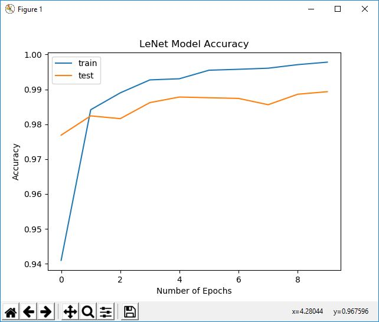

# LeNet for training on MNIST Handwritten Digits dataset

## What is LeNet ?

Yann le Cun proposed (for more information refer to: Convolutional Networks for Images, Speech,
and Time-Series, by Y. LeCun and Y. Bengio, brain theory neural networks, vol. 3361, 1995) a family
of ConvNets named LeNet trained for recognizing MNIST handwritten characters with robustness to
simple geometric transformations and to distortion. The key intuition here is to have low-layers
alternating convolution operations with max-pooling operations. The convolution operations are
based on carefully chosen local receptive fields with shared weights for multiple feature maps. Then,
higher levels are fully connected layers based on a traditional MLP with hidden layers and softmax as
the output layer.

# Accuracy Achieved = 99.6%

# Visualization

